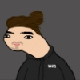
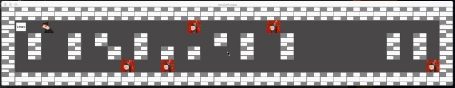
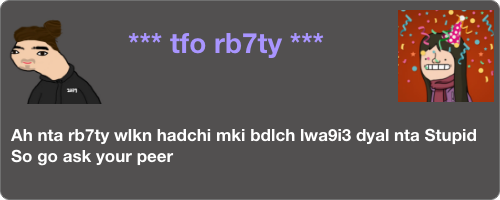

# SPOODY VS SOPU !

# Goals
This project’s objectives are similar to all this first year’s objectives: Rigor, use of C, use
of basic algorithms, information research etc.
As a graphic design project, so long will enable you to improve your skills in these
areas: windows, colors, events, textures, etc.
# Rules
- The W, A, S, and D keys will be used to move the main character.
- Pressing ESC must close the window and quit the program cleanly.
- Clicking on the red cross on the window’s frame must close the window and
quit the program cleanly
- The use of images of the minilibX is strongly recommended
# Players 
<table>
  <tr>
    <td> </td>
     <td></td>
     
  </tr>
</table>

# Game Preview

# YOU WIN!

